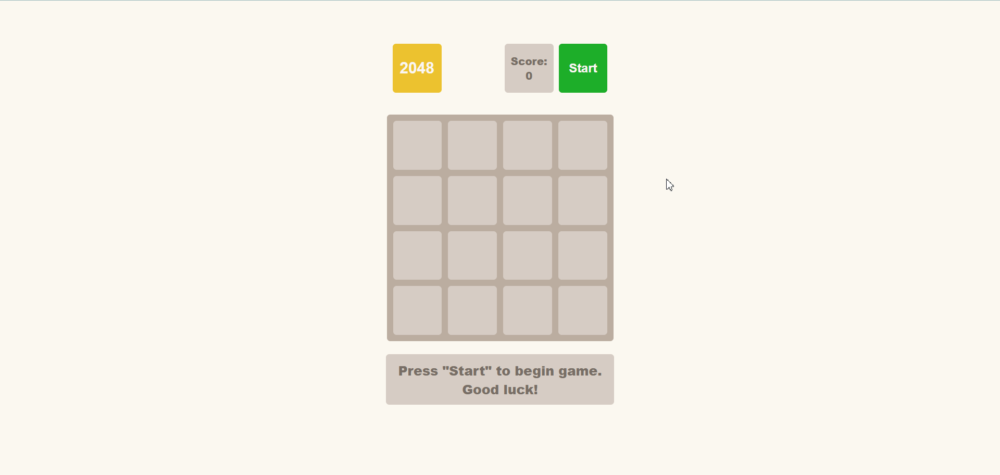

## 2048 Game in Pure JavaScript

### Overview:

The 2048 game is a classic puzzle game that involves sliding numbered tiles on a grid to combine them and reach the tile with the number 2048. This project implements the 2048 game using pure JavaScript, HTML, and CSS, providing a simple and interactive gaming experience.

## DEMO

- You can access a game with this [DEMO_LINK](https://bojkovladislav.github.io/2048-game/)

### Features:

1. **Game Grid:**

   - The game is played on a 4x4 grid.
   - Tiles with numbers appear on the grid, and the player can slide them in four directions: up, down, left, and right.

2. **Tile Movement:**

   - Tiles move in the selected direction until they reach the edge of the grid or collide with another tile.
   - If two tiles with the same number collide, they merge into a single tile with the sum of their values.

3. **Scoring:**

   - The player's score is determined by the sum of merged tiles during gameplay.
   - The goal is to reach the tile with the number 2048.

4. **Game Over:**

   - The game ends when there are no more valid moves (no empty spaces and no adjacent tiles with the same value).

5. **User Interface:**

   - The UI includes a score counter and a reset button to restart the game.
   - The current and best scores are displayed.

6. **Random Tile Generation:**
   - After each move, a new tile with a value of 2 or 4 is randomly generated and placed on an empty spot.

### Project Structure:

- **index.html:**

  - Contains the HTML structure for the game interface.
  - Links to the necessary CSS and JavaScript files.

- **main.scss:**

  - Defines the styles for the game grid, tiles, and UI elements.

- **main.js:**
  - Implements the game logic using pure JavaScript.
  - Manages tile movement, merging, scoring, and game over conditions.
